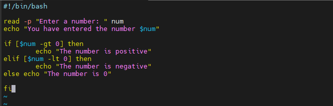
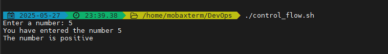
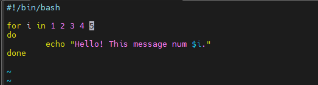
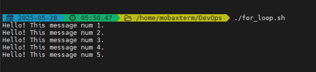
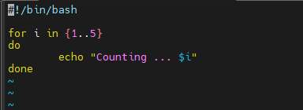
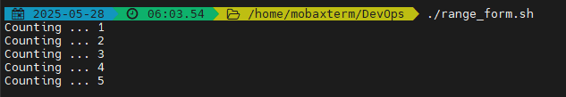

# Shell-scripting-control-flow

## Introduction to Control Flow:

Control flow in shell scripting refers to how the execution of commands is directed based on conditions or loops. It allows a script to make decisions and repeat tasks. The key control flow structures in shell scripting include:  
1. Conditional statements  
2. Loops  
3. Case statements

### 1. Conditonal Statements:

Conditional statements in shell scripting are used to make decisions based on certain conditions.

The basic structure is:

if [ condition ]; then  
    commands  
elif [ another_condition ]; then  
    other_commands  
else  
    fallback_commands  
fi

#### Task:

1. 

I created a .sh file named control_flow using the vim editor.

2. 

I wrote a conditional statement in the file. The script is to take in an input (a number) from the user, evaluate the input and display some messages based on the conditions met.

The if[$num -gt 0]; then part checks if num is greater than 0 and prints "The number is positive." if true.

If the first condition is not met (i.e., the number is not greater than 0), the elif [$num -lt 0]; then checks if num is less than 0. if this condition is true, it prints "The number is negative."

And if none of the two conditions are met, it prints "The number is 0."

This way, the script can differentiate between positive and negative numbers, providing specific feedback based on the value of num.

3. 

I changed the permision of the script to allow the owner execute.  
Then I ran the script inputting 5; I got the output, "The number is positive."

 ### For Loop:

 We use loops to automate and repeat tasks without having to rewrite the code over and over again.

 A for loop is used to repeat a set of commands for each item in a list.  
 The basic syntax is:  
 for variable in list    
 do  
&nbsp;&nbsp;&nbsp;&nbsp; commands  
done

The for loop has two main forms:

    1. The list form: iterates over a list. This is illustrated in the screenshot below.

The loop starts with *for i in 1 2 3 4 5*, meaning the variable i will take each value in the list (1,2,3,4,5) in turn.  
The command *echo "Hello! This message num $i.* prints a greeting along with the current value of i. Once i has taken each value in the list, the loop ends. 

I changed the file permision using the chmod command.

The I ran the script and it gave the desired output.

This same code can be can also be rewritten using range syntax as illustrated below:

Both will produce the same output as can be seen when i ran the script that contains the range syntax.

